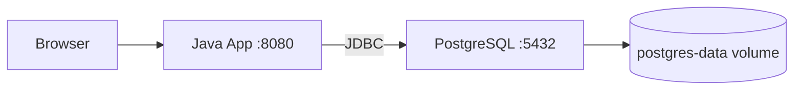

# Java Spring Boot + PostgreSQL Stack

Development stack for a Java Spring Boot application with PostgreSQL.

## Services

| Service | Image | Port | Description |
|---------|-------|------|-------------|
| java-app | Configurable via `APP_IMAGE` | 8080 | Spring Boot application |
| postgres | `postgres:16` | 5432 | Database |

## Getting Started

```bash
cp .env.example .env    # Edit the values
docker-compose up -d
```

- Application: http://localhost:8080

## Architecture



## Technical Decisions

- **`postgres:16`**: PostgreSQL LTS version, supported until 2028
- **Healthcheck**: `pg_isready` verifies PostgreSQL is accepting connections before starting the Java application
- **Spring variables**: `SPRING_DATASOURCE_URL` is passed via environment so Spring Boot connects automatically to PostgreSQL without modifying `application.properties`
- **Named volume**: PostgreSQL data persists between restarts
