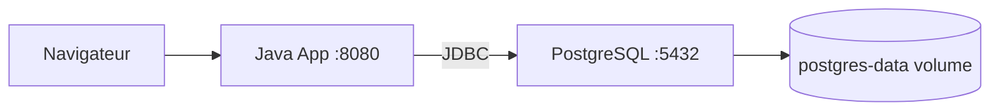

# Stack Java Spring Boot + PostgreSQL

Stack de developpement pour une application Java Spring Boot avec PostgreSQL.

## Services

| Service | Image | Port | Description |
|---------|-------|------|-------------|
| java-app | Configurable via `APP_IMAGE` | 8080 | Application Spring Boot |
| postgres | `postgres:16` | 5432 | Base de donnees |

## Demarrage

```bash
cp .env.example .env    # Modifier les valeurs
docker-compose up -d
```

- Application : http://localhost:8080

## Architecture



## Decisions techniques

- **`postgres:16`** : Version LTS de PostgreSQL, supportee jusqu'en 2028
- **Healthcheck** : `pg_isready` verifie que PostgreSQL accepte les connexions avant de demarrer l'application Java
- **Variables Spring** : `SPRING_DATASOURCE_URL` est passee via l'environnement pour que Spring Boot se connecte automatiquement a PostgreSQL sans modifier `application.properties`
- **Volume nomme** : Les donnees PostgreSQL persistent entre les redemarrages
