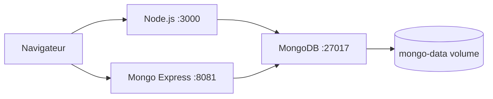

# Stack Node.js + MongoDB + Mongo Express

Stack de developpement pour une application Node.js avec MongoDB comme base de donnees et Mongo Express comme interface d'administration.

## Services

| Service | Image | Port | Description |
|---------|-------|------|-------------|
| app | `node:20-alpine` | 3000 | Application Node.js |
| mongodb | `mongo:7.0` | 27017 | Base de donnees |
| mongo-express | `mongo-express:1.0` | 8081 | Interface web MongoDB |

## Demarrage

```bash
cp .env.example .env    # Modifier les mots de passe
docker-compose up -d
```

- Application : http://localhost:3000
- Mongo Express : http://localhost:8081

## Architecture



## Decisions techniques

- **`mongo:7.0`** au lieu de `mongo:latest` : Version fixee pour des builds reproductibles
- **Healthcheck MongoDB** : `mongosh --eval "db.adminCommand('ping')"` verifie que MongoDB accepte les connexions avant de demarrer les services dependants
- **`restart: unless-stopped`** sur Mongo Express : Redemarrage automatique si le container crash, mais pas au reboot de la machine
- **Network isole** : `node-mongo-net` isole cette stack des autres stacks Docker sur la machine
- **Volume nomme** : `mongo-data` persiste les donnees entre les `docker-compose down`
