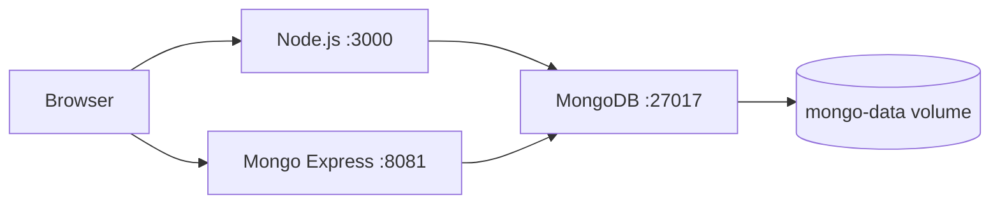

# Node.js + MongoDB + Mongo Express Stack

Development stack for a Node.js application with MongoDB as the database and Mongo Express as the admin interface.

## Services

| Service | Image | Port | Description |
|---------|-------|------|-------------|
| app | `node:20-alpine` | 3000 | Node.js application |
| mongodb | `mongo:7.0` | 27017 | Database |
| mongo-express | `mongo-express:1.0` | 8081 | MongoDB web interface |

## Getting Started

```bash
cp .env.example .env    # Edit the passwords
docker-compose up -d
```

- Application: http://localhost:3000
- Mongo Express: http://localhost:8081

## Architecture



## Technical Decisions

- **`mongo:7.0`** instead of `mongo:latest`: Pinned version for reproducible builds
- **MongoDB healthcheck**: `mongosh --eval "db.adminCommand('ping')"` verifies MongoDB is accepting connections before starting dependent services
- **`restart: unless-stopped`** on Mongo Express: Automatic restart if the container crashes, but not on machine reboot
- **Isolated network**: `node-mongo-net` isolates this stack from other Docker stacks on the machine
- **Named volume**: `mongo-data` persists data between `docker-compose down` calls
